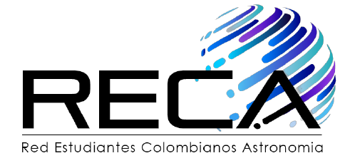

# RECA Internship Project

In this repository is located the report and all the notebooks used during the RECA internship: Study of the Photon Transfer Curve in the CCD detectors of the Vera Rubin Observatory.

       
                    

